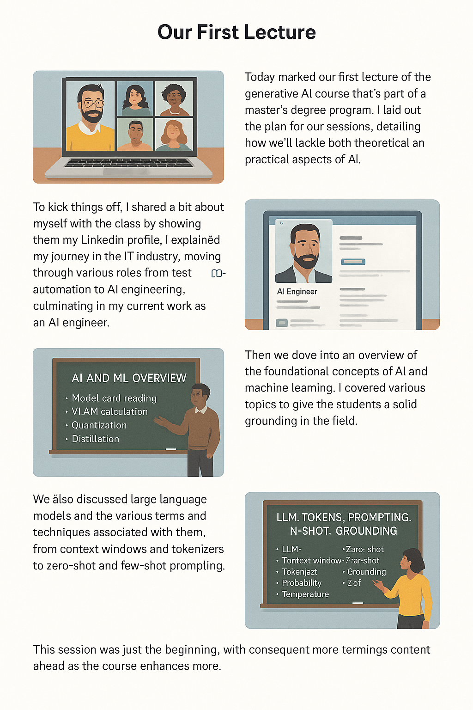

# Our First Lecture

Welcome to the journey through our **first lecture** of the *Generative AI* master's program! 🚀  
This session was packed with insight, inspiration, and a roadmap of what's to come.

### 🧠 Lecture Highlights

- Introduction to the course and the instructor’s background.
- Overview of AI & ML concepts: including quantization, distillation, model card reading, and more.
- Exploration of LLMs, prompting strategies, context windows, tokens, zero-shot and few-shot learning.
- Real-world insights and interactive Q&A with students from various countries.

This is just the beginning! 💡  
Stay tuned as we dive deeper into the world of AI in upcoming sessions.
